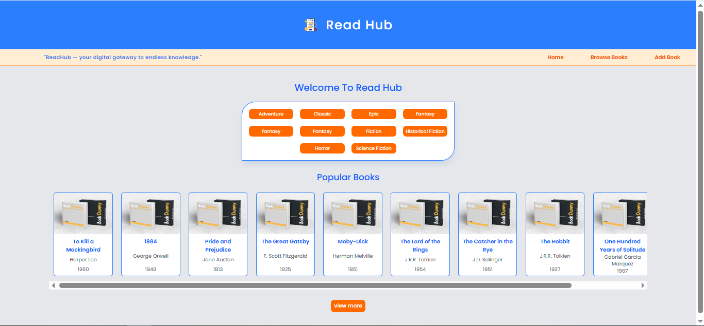
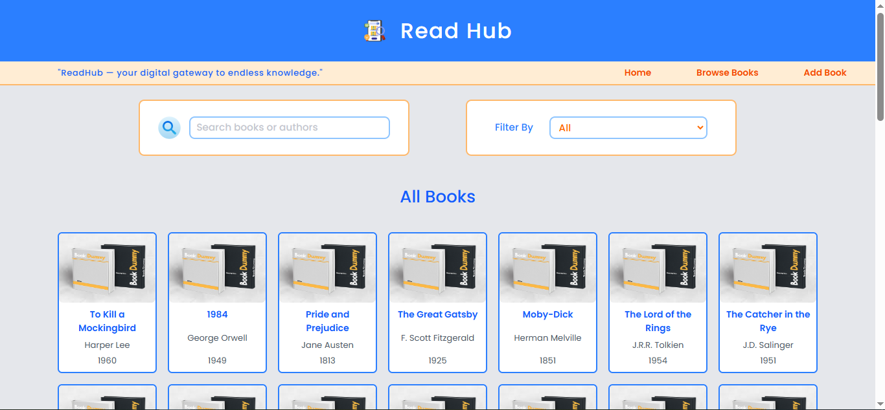
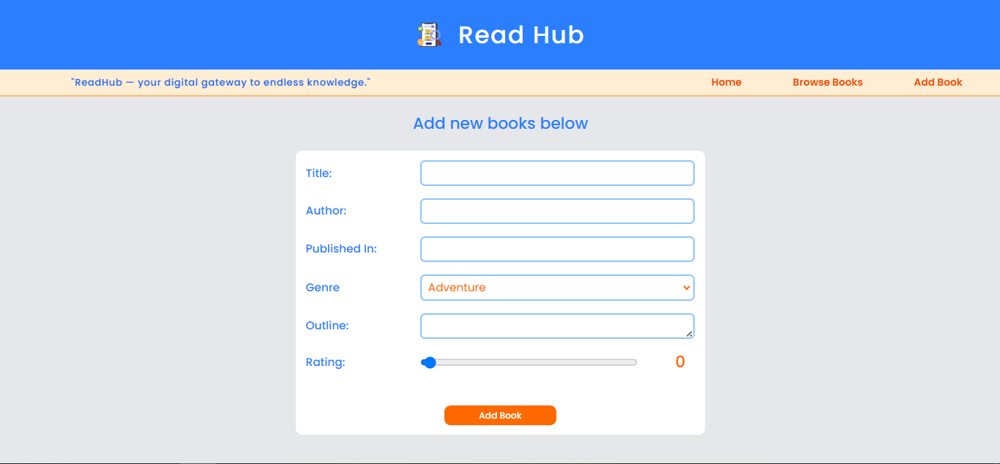
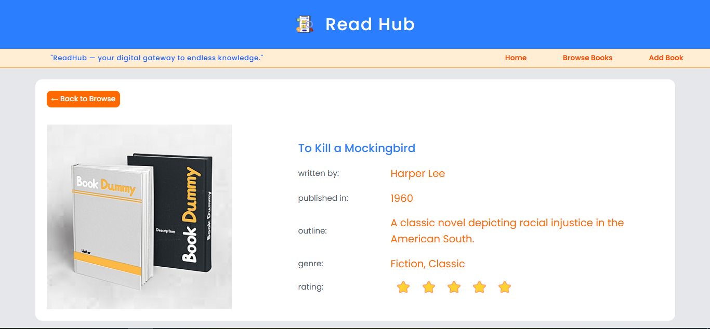

```markdown
# 📚 Read Hub

**Read Hub** is a sleek, modern web application for exploring and managing a digital library. Users can browse a curated list of books, view detailed descriptions, and manage entries with intuitive forms and validation. Built with React and Tailwind CSS, this project demonstrates clean UI practices and efficient state management using Redux Toolkit.

---

## 🚀 Features

- 📖 View a list of books with title, author, rating, and publish year
- ✍️ Add new books via a styled form with validation
- 🔄 Edit and delete existing books
- ⭐ Display ratings using star icons
- 🎯 Responsive design with Tailwind CSS
- ⚛️ State management using Redux Toolkit
- ❌ Error page handling with React Router
- 🔍 Search/filter support (if added)

---

## 📂 Tech Stack

- **Frontend:** React, Tailwind CSS
- **Routing:** React Router
- **State Management:** Redux Toolkit
- **Icons/Rating:** Custom SVG or font-based icons
- **Deployment:** Vercel (or insert your platform)

---

## 📸 Screenshots

1. **Home Page:**


2. **Browse Books Page:**


3. **Add Book Page:**


4. **Book Details Page:**

---

## ⚙️ Getting Started

### Prerequisites
- Node.js and npm

### Installation

1. **Clone the repo**
   ```bash
   git clone https://github.com/visaal1582892/read_hub.git
   cd read_hub
   ```

2. **Install dependencies**
   ```bash
   npm install
   ```

3. **Start the dev server**
   ```bash
   npm run dev
   ```

---

## 🛠️ Folder Structure

```
read-hub/
├── public/
├── src/
│   ├── components/
│   ├── pages/
│   ├── redux/
│   ├── assets/
│   └── App.jsx
├── tailwind.config.js
├── vite.config.js
└── README.md
```

---

## 🧠 Learnings

- Working with React Router and dynamic routes
- Redux slices, actions, and selectors
- Tailwind CSS utility-first styling
- Form validation and input restrictions (e.g. disallowing numbers in name fields)
- Handling deployment errors (like 404 on refresh, proxy configs)

---

## 📦 Deployment

App is deployed and accessible at:  
👉 [Live Demo](https://read-hub-eight.vercel.app/)

---

## 📬 Contact

Made with 💙 by [Rohit Varma Datla]  
📧 [visaal1582892@gmail.com]  

```